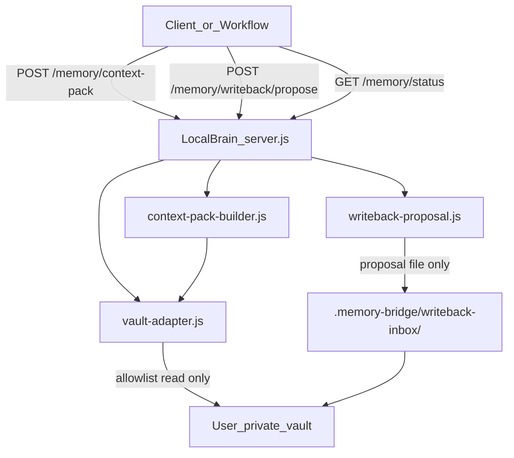

# Memory Bridge v0 — Implementation Plan

## Alignment summary

From [docs/LocAIly_ and_Second Brain_Alignment_and_Connection.md](docs/LocAIly_%20and_Second%20Brain_Alignment_and_Connection.md):

- **Second Brain** = private memory vault (raw sources + wiki synthesis). Stays outside LocAIly.
- **LocAIly** = public runtime (Local Brain, tools, tracks). Owns the bridge code.
- **Memory Bridge** = the nervous system: read allowlisted vault files → build task-specific **Context Pack** → optional **Writeback Proposal** (human review, no auto-apply).
- **System learning** = memory, routing, validation, and reviewable writeback — not model weight changes.



---

## Path layout decision (confirmed)

- **Starter template** uses flat layout: `projects/`, `topics/` (per your file list).
- **Default config** ships with flat `allowedPaths` matching the template.
- **SCHEMA.md + allowlist.example.json** document Second Brain `wiki/projects/`, `wiki/topics/`, etc. and how users extend `allowedPaths` for their vault shape.

---

## Phase 1 — Documentation and contracts

### New architecture docs

| File | Purpose |
|------|---------|
| [docs/01-architecture/memory-bridge.md](docs/01-architecture/memory-bridge.md) | Bridge role, read vs writeback, privacy boundaries, v0 scope (no embeddings/GitHub/Obsidian), endpoint overview |
| [docs/01-architecture/context-packs.md](docs/01-architecture/context-packs.md) | Context Pack JSON contract, fields, request shape, deterministic v0 selection rules |
| [docs/01-architecture/memory-writeback.md](docs/01-architecture/memory-writeback.md) | Proposal-only loop, inbox path, raw/ never edited, human review required, future `/apply` deferred |

### Decision record

| File | Purpose |
|------|---------|
| [docs/06-decisions/second-brain-as-memory-layer.md](docs/06-decisions/second-brain-as-memory-layer.md) | Record: repos stay separate; LocAIly ships adapter + template; private vault path is user-configured; no uncontrolled mutation |

Also append a short entry to [docs/06-decisions/decision-log.md](docs/06-decisions/decision-log.md).

### Vision and roadmap updates

- [docs/00-start-here/current-vision.md](docs/00-start-here/current-vision.md) — add **Memory Layer** subsection: LocAIly works standalone; optional vault via Memory Bridge; no repo merge.
- [docs/05-product/roadmap.md](docs/05-product/roadmap.md) — add **Now — Memory Bridge v0** items (docs, adapter, endpoints, smoke); move embeddings/search/apply to **Next**.

### API contract (recommended addition)

Update [docs/01-architecture/api-contract.md](docs/01-architecture/api-contract.md) with the three memory endpoints and envelope shapes so clients have a single source of truth.

### Public starter template

Create under `templates/memory-vault/`:

```
templates/memory-vault/
  README.md              # BYO vault setup, point LocAIly at local path
  SCHEMA.md              # flat + wiki/ layout notes, raw/ rules
  index.md               # navigation hub
  log.md                 # episodic history stub
  projects/Example Project.md
  topics/Example Topic.md
  .memory-bridge/
    config.example.json
    allowlist.example.json   # flat default + commented wiki/ entries
```

Template content stays generic — no private Second Brain material.

---

## Phase 2 — Minimal implementation

### Module layout

```
companion/memory/
  vault-adapter.js         # config, path safety, allowlist scan, file read
  context-pack-builder.js  # task-specific pack from allowed Markdown
  writeback-proposal.js    # validate + write inbox proposal
companion/schemas/
  context-pack.schema.json
  memory-writeback.schema.json
```

Factory pattern (matches existing `createToolRegistry`, `createPermissionManager` style):

```js
// server.js wiring
const memoryBridge = createMemoryBridgeManager(config.memoryBridge);
```

### `vault-adapter.js` responsibilities

- Load config from [companion/config.json](companion/config.json) `memoryBridge` block (merged into `DEFAULT_CONFIG` in [companion/server.js](companion/server.js)).
- Optional env override: `LOCAL_MEMORY_VAULT_PATH` sets `vaultPath` when enabled.
- Optional vault-local merge: read `vaultPath/.memory-bridge/config.json` if present (allowlist overrides only; never enable `rawAccess` from vault file alone).
- **Path safety**: resolve paths under vault root; reject `..`, absolute escapes, symlinks outside vault (best-effort on Windows).
- **Read policy**: `readPolicy: "allowlist"` — only paths matching `allowedPaths` prefixes; always enforce `blockedPaths` (including `raw/` even if `rawAccess: true` in v0 — treat `rawAccess: false` as hard block).
- **Status probe**: `index.md` readable, project/topic counts, list of unreadable allowlist entries.
- **List + read**: return relative paths and UTF-8 content for `.md` files only in v0.

### `context-pack-builder.js` responsibilities (deterministic v0)

No embeddings, no model calls. Boring keyword/path matching:

1. Always try `index.md`, `log.md` if allowlisted.
2. Match `project` to `projects/*.md` or `wiki/projects/*.md` (case-insensitive filename contains).
3. Match `task` keywords against topic filenames and first ~2KB of content.
4. Cap files via request `maxFiles` (default 8).
5. Extract structured fields from Markdown headings:
   - `## Decisions` / `## Key decisions` → `keyDecisions`
   - `## Constraints` → `knownConstraints`
   - `## Open questions` → `openQuestions`
6. Build `summary` from index excerpt + matched file titles (truncated).
7. Populate `warnings` when: memory disabled, vault partial, fallback heuristics used, files skipped.
8. Validate output against `context-pack.schema.json` via existing [companion/core/result-validator.js](companion/core/result-validator.js).

Request shape (POST body):

```json
{
  "project": "Example Project",
  "task": "Plan Memory Bridge v0",
  "include": ["current_state", "known_decisions", "constraints", "open_questions"],
  "maxFiles": 8
}
```

### `writeback-proposal.js` responsibilities

- Validate input against `memory-writeback.schema.json`.
- Write **only** to `{vaultPath}/.memory-bridge/writeback-inbox/{ISO-date}-{slug}.md`.
- Markdown body: task, decisions, lessons, suggested updates, `requiresHumanReview: true`.
- Return `{ proposalPath, proposalId }` — never modify `index.md`, `log.md`, wiki pages, or `raw/`.
- Gate on `writebackMode === "proposal_only"` and `memoryBridge.enabled === true`; otherwise return error with warning.
- Use dedicated permission `memory.writeback.propose` (approve in config when user enables writeback; separate from denied `file.write`).

### Config changes

Add to `DEFAULT_CONFIG` and [companion/config.json](companion/config.json) (disabled by default):

```json
"memoryBridge": {
  "enabled": false,
  "vaultPath": null,
  "mode": "local_markdown_vault",
  "readPolicy": "allowlist",
  "writebackMode": "proposal_only",
  "rawAccess": false,
  "allowedPaths": ["index.md", "log.md", "SCHEMA.md", "projects/", "topics/"],
  "blockedPaths": ["raw/", "private/", "personal/", ".git/", ".memory-bridge/writeback-inbox/"]
}
```

Extend `mergeConfig()` in [companion/server.js](companion/server.js) to deep-merge `memoryBridge`.

### HTTP endpoints (add to [companion/server.js](companion/server.js))

| Endpoint | Behavior |
|----------|----------|
| `GET /memory/status` | Always 200. Reports `enabled`, `mode`, `vaultPathConfigured`, `readable`, `writebackMode`, `rawAccess`, counts, `warnings[]` |
| `POST /memory/context-pack` | Builds pack; 200 on success, 400 on bad JSON/validation, 503-style body with `ok: false` when disabled (still includes `warnings`) |
| `POST /memory/writeback/propose` | Writes inbox proposal; 400 when disabled or vault not writable |

**Envelope** (consistent, simpler than `/tasks/run`):

```json
{
  "ok": true,
  "result": { },
  "warnings": [],
  "meta": { "requestId": "...", "durationMs": 0, "createdAt": "..." }
}
```

Update 404 `nextStep` hint to include memory routes.

Optional: add `memory` summary stub to `GET /health` (`enabled`, `readable`) — lightweight discoverability without duplicating full status.

### Schemas

**context-pack.schema.json** — required: `contextPackId`, `project`, `task`, `summary`, `filesUsed`, `keyDecisions`, `knownConstraints`, `openQuestions`, `warnings`, `recommendedNextStep`.

**memory-writeback.schema.json** — required: `taskId`, `project`, `task`, `decisionsMade`, `newLessons`, `suggestedUpdates`, `requiresHumanReview` (must be `true` in v0).

---

## Smoke test strategy

Extend [scripts/smoke-test.js](scripts/smoke-test.js):

| Check | How |
|-------|-----|
| Memory disabled (HTTP) | `GET /memory/status` with default config → `enabled: false`, warning present |
| Memory disabled context-pack | `POST /memory/context-pack` → `ok: false`, graceful warning |
| Memory enabled (module) | `require("../companion/memory/vault-adapter")` + `context-pack-builder` against absolute path `templates/memory-vault` with test config object (no server restart) |
| Writeback propose (module) | Write to temp dir copy of template; assert file in `writeback-inbox/` |
| Optional HTTP enabled | Document env `LOCAL_MEMORY_VAULT_PATH` + `memoryBridge.enabled: true` for manual integration test |

This satisfies "disabled + enabled with starter template" without requiring smoke to restart the server mid-run.

---

## Files created/updated (checklist)

**Create (22):** 6 docs + 8 template files + 3 memory modules + 2 schemas + decision doc + smoke checks

**Update (5):** `companion/server.js`, `companion/config.json`, `current-vision.md`, `roadmap.md`, `decision-log.md`, `api-contract.md`

---

## v0 behavior summary (deliverable)

1. LocAIly runs normally when `memoryBridge.enabled` is false; all memory endpoints respond with clear warnings.
2. User copies `templates/memory-vault/` to a private location and sets `vaultPath` in config.
3. Allowlist governs reads; `raw/` and blocked paths never returned.
4. Context Pack returns inspectable `filesUsed`, extracted decisions/constraints/questions, and heuristic summary.
5. Writeback creates reviewable inbox Markdown only — no automatic wiki edits.
6. Private content never enters the LocAIly repo.

---

## How to test with starter vault

1. Copy template: `cp -r templates/memory-vault ~/my-memory-vault` (or Windows equivalent).
2. Edit [companion/config.json](companion/config.json): `enabled: true`, `vaultPath: "C:/path/to/my-memory-vault"`.
3. Restart server: `node companion/server.js`.
4. `GET http://127.0.0.1:31313/memory/status` → `readable: true`.
5. `POST /memory/context-pack` with `{ "project": "Example Project", "task": "test context pack" }`.
6. `POST /memory/writeback/propose` with sample decisions → check `~/my-memory-vault/.memory-bridge/writeback-inbox/`.
7. Run `node scripts/smoke-test.js`.

---

## Privacy and safety concerns (document in memory-bridge.md)

| Risk | Mitigation in v0 |
|------|------------------|
| Context pack responses expose vault text over HTTP | Localhost-only default; docs warn users; audit log should not store full pack content |
| Misconfigured allowlist reads personal folders | Default blocked paths; vault-local allowlist is opt-in; status reports partial reads |
| Path traversal | Normalize + reject escapes |
| Writeback inbox on shared vault | Proposals only; human review; inbox path outside read allowlist |
| Smoke/module tests writing to template dir | Tests use `os.tmpdir()` copies |

---

## Recommended next step after v0

**Wire Context Pack into one real workflow** (Lighthouse Handoff): preflight call to `/memory/context-pack` for project/site constraints, attach `filesUsed` + warnings to task run metadata. Then add vault-local `.memory-bridge/` to your private Second Brain and validate end-to-end proposal review.

Deferred: `/memory/writeback/apply`, embeddings/search, track auto-preflight, NearbyNode storage connector.
