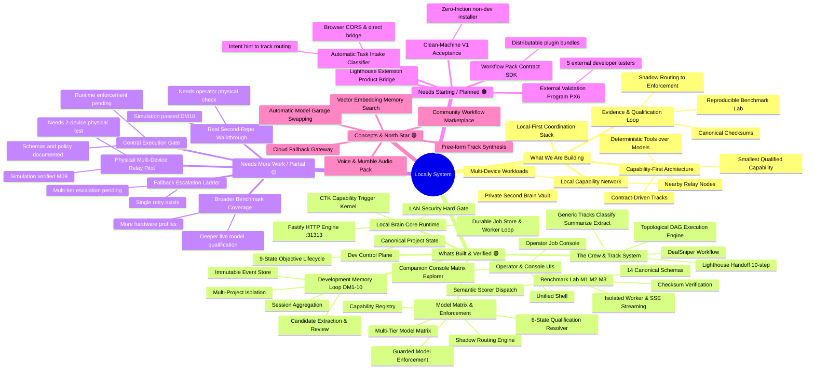

# Locaily System Mind Map & Status Atlas

> **Project Vision:** A local-first AI coordination stack. Rather than relying on a single monolithic cloud model, Locaily decomposes practical work into narrow contracts (**Tracks**) and routes each step to the **smallest qualified capability** (deterministic tools, fast local models, reasoning models, or relay nodes) with verifiable evidence and reproducible qualification.

---

## 1. High-Level System Mind Map

---

## 2. Architecture & Subsystem Relationship Map

```mermaid
flowchart TD
  classDef built fill:#1e3a1e,stroke:#4ade80,stroke-width:2px,color:#f0fdf4;
  classDef partial fill:#3b2d11,stroke:#facc15,stroke-width:2px,color:#fefce8;
  classDef planned fill:#3d1a11,stroke:#fb923c,stroke-width:2px,color:#fff7ed;
  classDef concept fill:#2a1b3d,stroke:#c084fc,stroke-width:2px,color:#faf5ff;

  subgraph Clients["Client & UI Layer"]
    UI1["Companion Console & Matrix Explorer"]:::built
    UI2["Operator Console (Jobs & Mutations)"]:::built
    UI3["Unified Shell (Model Lab UI)"]:::built
    UI4["Lighthouse Extension Bridge"]:::planned
    UI5["Clean-Machine Launcher"]:::planned
  end

  subgraph ControlPlane["Development Control Plane"]
    CP1["project-state.json & AGENTS.md"]:::built
    CP2["9-State Objective Lifecycle"]:::built
    CP3["Milestones & Session Logs"]:::built
  end

  subgraph LocalBrain["Local Brain (Coordinator - localhost:31313)"]
    LB1["Fastify HTTP API & Endpoints"]:::built
    LB2["CTK Kernel (Events, Roles, Capsules)"]:::built
    LB3["LAN Security Hard Gate"]:::built
    LB4["Durable Job Store & Worker Loop"]:::built
    LB5["Central Execution Policy Gate"]:::partial
  end

  subgraph Orchestration["The Crew & Track Engine"]
    CR1["Linear & DAG Track Runner"]:::built
    CR2["Generic Tracks (classify/summarize/extract)"]:::built
    CR3["Proof Workflows (Lighthouse / DealSniper)"]:::built
    CR4["Composed Workflows (repo_review, text_qa, etc.)"]:::built
    CR5["Automatic Task Intake Classifier"]:::planned
  end

  subgraph RoutingEnforcement["Routing & Enforcement Subsystem"]
    RE1["Capability Registry"]:::built
    RE2["6-State Qualification Resolver"]:::built
    RE3["Shadow Routing Engine"]:::built
    RE4["Guarded Enforcement Policy Engine"]:::built
    RE5["Multi-Tier Fallback Escalation"]:::partial
  end

  subgraph BenchmarkLab["Benchmark Lab (Subsystem)"]
    BL1["CLI Evaluation Engine & 14 Schemas"]:::built
    BL2["Semantic Scorer Dispatch (M2)"]:::built
    BL3["Interactive UI & Isolated Worker (M3)"]:::built
    BL4["Promotion, Checksums & Qual Records"]:::built
    BL5["Broader Hardware & Model Coverage"]:::partial
  end

  subgraph Distributed["Relay Nodes (Nearby Device Layer)"]
    RN1["Relay Protocol & Node Registry"]:::built
    RN2["Placement Planner & Local Fallback"]:::built
    RN3["M09A Trust & Pairing Handshake"]:::built
    RN4["Physical 2-Device Network Pilot"]:::partial
  end

  subgraph Memory["Memory Bridge & Development Loop"]
    MB1["Context Packs & Allowlisted Search"]:::built
    MB2["DM1-DM10 Event Store & Sessions"]:::built
    MB3["Candidate Inbox & Maintainer Drift"]:::built
    MB4["Real Second-Repo Walkthrough"]:::partial
    MB5["Vector Embedding Search"]:::concept
  end

  Clients --> LocalBrain
  ControlPlane -.-> LocalBrain
  LocalBrain --> Orchestration
  Orchestration --> RoutingEnforcement
  RoutingEnforcement --> BenchmarkLab
  Orchestration --> Distributed
  LocalBrain --> Memory
```

---

## 3. Detailed Status Breakdown

### 🟢 What's Built & Verified (Operational & Tested)

These modules are fully implemented, accompanied by passing automated test suites in `npm run test:full`, and documented in canonical development state.

| Area | Component | Implementation Location | Verified Capabilities |
|---|---|---|---|
| **Local Brain** | **Core Server & API** | [companion/server.js](file:///c:/Users/JP/Desktop/locailly/companion/server.js) | Fastify HTTP server on `127.0.0.1:31313`, `/health`, `/tasks/run`, `/tracks/run`, `/workflows/*` |
| **Local Brain** | **Durable Job Store** | [companion/jobs/](file:///c:/Users/JP/Desktop/locailly/companion/jobs/) | Persistent job lifecycle (`queued`, `running`, `paused_review`, `completed`, `failed`), mutation endpoints (`cancel`, `retry`, `review`), background polling worker |
| **Local Brain** | **Capability Trigger Kernel (CTK-01..03)** | [companion/capability-kernel/](file:///c:/Users/JP/Desktop/locailly/companion/capability-kernel/) | Event-driven kernel, capability capsules with checksum verification, secret-free bindings, node roles (`brain`, `worker`, `hybrid`), local event bus |
| **Security** | **LAN Security Hard Gate (PX2)** | [companion/server.js](file:///c:/Users/JP/Desktop/locailly/companion/server.js#L140) | Refuses non-loopback binding unless `RELAY_TOKEN`, `LAN_MODE=1`, and allowlists are configured; Bearer token enforcement on all relay endpoints |
| **The Crew** | **Track & DAG Engine** | [companion/crew/](file:///c:/Users/JP/Desktop/locailly/companion/crew/) & [companion/core/dag-executor.js](file:///c:/Users/JP/Desktop/locailly/companion/core/dag-executor.js) | Reusable contracts, declarative `input_map`, linear runner and topological DAG execution with level-based parallelism |
| **The Crew** | **Generic Core Tracks (CORE-01)** | [companion/crew/tracks/](file:///c:/Users/JP/Desktop/locailly/companion/crew/tracks/) | `core.classify`, `core.summarize`, `core.extract` — standard contract-backed units of work |
| **Workflows** | **Multi-Track Composed Workflows (CORE-01/05)** | [companion/orchestration/](file:///c:/Users/JP/Desktop/locailly/companion/orchestration/) | `repo_review`, `text_qa`, `document_review`, `content_os` running across multiple tracks with dependency chains |
| **Proof Tracks** | **Lighthouse Handoff & DealSniper** | [companion/crew/tracks/](file:///c:/Users/JP/Desktop/locailly/companion/crew/tracks/) | 10-step Lighthouse audit assembly (priority helper, developer task writer, guardrails, testing checklist); DealSniper marketplace parser |
| **Evaluation** | **Benchmark Lab M1 (Engine & CLI)** | [benchmark-lab/](file:///c:/Users/JP/Desktop/locailly/benchmark-lab/) | 14 JSON schemas, CLI (`run`, `compare`, `promote`, `matrix`, `report`), mock & Ollama runtime adapters, Tool Eval bench slice |
| **Evaluation** | **Benchmark Lab M2 (Semantic Scoring)** | [benchmark-lab/engine/evaluators/](file:///c:/Users/JP/Desktop/locailly/benchmark-lab/engine/evaluators/) | Generic semantic scorer dispatch for accessibility, performance budget, SEO audit, dealsniper with Wilson confidence intervals |
| **Evaluation** | **Benchmark Lab M3 (Interactive UI)** | [companion/shell/](file:///c:/Users/JP/Desktop/locailly/companion/shell/) | Localhost model inventory, explicit load/unload controls, isolated worker execution, SSE progress streaming, crash/restart recovery |
| **Routing** | **Qualification Resolver & Capability Registry** | [companion/core/qualification-resolver.js](file:///c:/Users/JP/Desktop/locailly/companion/core/qualification-resolver.js) | 6 consume states (`qualified`, `unqualified`, `expired`, `stale`, `invalid`, `untested`); Capability Registry index |
| **Routing** | **Shadow Routing Engine** | [companion/core/shadow-routing.js](file:///c:/Users/JP/Desktop/locailly/companion/core/shadow-routing.js) | Real-time comparison between active model choice and qualification-backed recommendation (`agree`, `disagree`, etc.) |
| **Enforcement** | **Guarded Enforcement Policy Engine** | [companion/core/enforcement-policy.js](file:///c:/Users/JP/Desktop/locailly/companion/core/enforcement-policy.js) | 5 rollout states (`disabled`, `shadow`, `eligible`, `enforced`, `suspended`), 8+ eligibility checks, auto fallback to default model on failure |
| **Model Matrix** | **Complete Generic Matrix (CORE-02..04)** | [companion/core/capability-registry.js](file:///c:/Users/JP/Desktop/locailly/companion/core/capability-registry.js) | Multi-tier coverage: Tier 1 default (`llama3.2-local`), Tier 2 fallback (`lfm25-1p2b-thinking-local`), Tier 3 fast worker (`lfm25-1p2b-instruct-local`), edge worker (`lfm25-350m-local`) |
| **Memory** | **Development Memory Loop (DM1..DM10)** | [companion/memory/](file:///c:/Users/JP/Desktop/locailly/companion/memory/) | Layer A event store, session aggregation, Layer B candidate extraction, human review inbox (`/memory/candidates/review`), project maintainer drift planner, continuous capture worker, multi-project template isolation |
| **Relay** | **Relay Node Protocol & Routing (M4/M5/M09A)** | [companion/relay/](file:///c:/Users/JP/Desktop/locailly/companion/relay/) | Node registration, heartbeat, step delegation, placement planner with `distribute` policy, pairing handshake and trust boundary |
| **UI** | **Operator Console** | [companion/operator/index.html](file:///c:/Users/JP/Desktop/locailly/companion/operator/index.html) | Live job board, mutation triggers (cancel/retry/review), payload inspector at `GET /operator` |
| **UI** | **Companion Console & Matrix Explorer (CORE-05)** | [companion/console/index.html](file:///c:/Users/JP/Desktop/locailly/companion/console/index.html) | Interactive generic workflow runner, Model Qualification Matrix table, tier breakdown cards, live shadow routing & fallback dry-run tester |
| **Control Plane** | **Development Lifecycle & AGENTS.md** | [development/](file:///c:/Users/JP/Desktop/locailly/development/) & [AGENTS.md](file:///c:/Users/JP/Desktop/locailly/AGENTS.md) | `project-state.json`, milestone manifests, 9-state objective lifecycle (`scripts/objective-lifecycle.js`), `npm run dev:status` |

---

### 🟡 What Needs More Work / Partial (In Progress or Hardened in Simulation)

These features have substantial foundations, architectural code, or simulated test passes, but require real-world validation, deeper execution boundaries, or end-to-end operational hardening:

1. **Physical Two-Device Relay Pilot (M09B)**
   - *Current state:* Protocol, pairing ceremony (M09A), placement planner, and distributed execution pass in unit & simulation tests (`test-multi-device-e2e.cjs`).
   - *What's needed:* Real physical test across two actual machines on the same local network running live Ollama instances with network latency, intermittent dropouts, and failover verification.
2. **Central Execution Gate Enforcement**
   - *Current state:* Comprehensive security documentation (`docs/security/`), threat models, and schemas (`policies/default-execution-policy.json`, `action-request.schema.json`, `policy-decision.schema.json`) exist.
   - *What's needed:* Runtime interceptor enforcing filesystem, shell, and network side effects through a unified gate where destructive actions strictly require human approval.
3. **Second-Repository Operator Acceptance (DM Loop)**
   - *Current state:* DM10 multi-project template and simulated multi-repo isolation tests pass (`test-development-memory-e2e.js`).
   - *What's needed:* A brief hands-on operator test on a real, independent second git repository to verify the zero-leakage vault boundary and capture behavior.
4. **Broader Benchmark Lab Model & Hardware Coverage**
   - *Current state:* Ollama and mock adapters qualified for `llama3.2:latest`, `lfm25-1.2b`, and `lfm25-350m` on specific evaluation suites.
   - *What's needed:* Expanding the suite to cover additional quantized models (e.g. Qwen2.5-Coder, Mistral-Nemo, Phi-3.5), measuring real hardware VRAM/RAM constraints, and running live prompt regression suites.
5. **Multi-Tier Fallback Escalation Ladder**
   - *Current state:* Single retry (`retry_same_model_once`) and primary-to-fallback routing exist in guarded enforcement.
   - *What's needed:* A full escalation policy engine that cascades across Tier 1 (Default) -> Tier 2 (Fallback) -> Tier 3 (Fast Worker) -> Deterministic Tool -> Operator Pause when errors or schema rejections occur.
6. **Planned vs. Actual Placement Reconciliation**
   - *Current state:* Placement planner generates an execution plan, but when a node drops and execution falls back to local host, the placement manifest is not dynamically re-stamped.

---

### 🟠 What Needs Starting / Planned (Approved & Scoped on the Backlog)

These items represent concrete, well-defined next steps that have clear problem statements and acceptance criteria waiting to be initiated:

1. **PX6 — External Validation Readiness** *(Milestone planned in `development/milestones/px6-external-validation-program.json`)*
   - *Goal:* Validate Locaily with 5 external developer testers running Lighthouse Handoff unassisted, conduct authenticated two-device relay runbook, and record real friction/metrics.
2. **Clean-Machine V1 Installer & Acceptance**
   - *Goal:* Create a validated zero-friction setup package for non-developers on a clean Windows machine (one-click launch, automatic Ollama reachability check, fallback to deterministic mode, clean uninstaller).
3. **Lighthouse Handoff Chrome Extension Product Bridge**
   - *Goal:* Connect the real browser extension to the Local Brain with explicit CORS policy, connection heartbeat, real PageSpeed JSON parsing, and export to coding-agent markdown.
4. **Workflow Pack Contract & Starter SDK**
   - *Goal:* Formalize the tool pack pattern into a complete distributable plugin specification (`pack.json`, tracks, tools, prompts, schemas, fixtures, qualification requirements) so third parties can build workflows without modifying core Locaily code.
5. **Automatic Task Intake & Intent Classifier**
   - *Goal:* Narrow, deterministic intent classifier that accepts natural language requests, evaluates capability requirements, maps them to known tracks, and asks for user confirmation if ambiguous.

---

### 🟣 Concepts, Research & North Star (Exploratory / Unimplemented)

These are architectural north stars and exploratory ideas documented in design notes that are intentionally not yet scheduled:

1. **Vector Embedding Retrieval for Memory Bridge**
   - Current memory retrieval relies on deterministic canonical page ranking and structured search. Semantic vector embeddings remain an opt-in future exploration.
2. **Community Workflow Marketplace**
   - Decentralized or catalog-driven sharing of validated Workflow Packs, Track declarations, and evaluation suites.
3. **Model Garage & Adaptive Memory Swapping**
   - Dynamic VRAM management that hot-swaps GGUF models in and out of GPU memory based on upcoming track step requirements without operator manual intervention.
4. **Audio / Voice & Mumble Interface Pack**
   - Hands-free voice input and auditory feedback for workflow triggers and status alerts.
5. **Cloud Fallback Gateway**
   - Opt-in, zero-trust cloud escalation (e.g. to commercial APIs) strictly when local hardware capabilities are exceeded and explicitly authorized by the operator.
6. **Free-Form Autonomous Track Generation**
   - Enabling reasoning models to author new valid Track contracts on the fly rather than using pre-authored JSON contracts.

---

## 4. Current Capability & Model Qualification Matrix

As of **CORE-04** and **CORE-05**, the generic capability matrix provides multi-tier local model coverage across standard contracts:

| Capability Track | Role Slot | Tier 1 (Default Qualified) | Tier 2 (Secondary Fallback) | Tier 3 (Fast Worker) | Edge Worker |
|---|---|---|---|---|---|
| `core.classify` | `classifier` | `llama3.2-local` (1.00) | `lfm25-1p2b-thinking-local` (1.00) | `lfm25-1p2b-instruct-local` (1.00) | `lfm25-350m-local` (1.00) |
| `core.summarize` | `summarizer` | `llama3.2-local` (1.00) | `lfm25-1p2b-thinking-local` (1.00) | `lfm25-1p2b-instruct-local` (1.00) | *Untested* |
| `core.extract` | `extractor` | `llama3.2-local` (1.00) | `lfm25-1p2b-thinking-local` (1.00) | `lfm25-1p2b-instruct-local` (1.00) | *Untested* |
| `website_audit.lighthouse_handoff` | `priority_helper` | `lfm25-1p2b-thinking-local` (0.92) | *Enforced* | — | — |
| `website_audit.lighthouse_handoff` | `developer_task_writer` | `lfm25-1p2b-thinking-local` (1.00) | *Enforced* | — | — |
| `website_audit.lighthouse_handoff` | `guardrail_writer` | `lfm25-1p2b-thinking-local` (1.00) | *Enforced* | — | — |
| `website_audit.lighthouse_handoff` | `testing_checklist_writer` | `lfm25-1p2b-thinking-local` (1.00) | *Qualified* | — | — |
| `marketplace.dealsniper` | `default_worker` | `llama3.2-local` (1.00) | *Shadow* | — | — |

---

## 5. Architectural Guide & Key File Pointers

- **Development Pointer:** [development/project-state.json](file:///c:/Users/JP/Desktop/locailly/development/project-state.json)
- **Agent Rules & Lifecycle:** [AGENTS.md](file:///c:/Users/JP/Desktop/locailly/AGENTS.md)
- **Local Brain Server:** [companion/server.js](file:///c:/Users/JP/Desktop/locailly/companion/server.js)
- **Capability Registry:** [companion/core/capability-registry.js](file:///c:/Users/JP/Desktop/locailly/companion/core/capability-registry.js)
- **Shadow Routing & Enforcement:** [companion/core/shadow-routing.js](file:///c:/Users/JP/Desktop/locailly/companion/core/shadow-routing.js) & [companion/core/enforcement-policy.js](file:///c:/Users/JP/Desktop/locailly/companion/core/enforcement-policy.js)
- **Track Runner & Crew:** [companion/crew/orchestrator.js](file:///c:/Users/JP/Desktop/locailly/companion/crew/orchestrator.js) & [companion/core/dag-executor.js](file:///c:/Users/JP/Desktop/locailly/companion/core/dag-executor.js)
- **Benchmark Lab CLI & Suites:** [benchmark-lab/engine/](file:///c:/Users/JP/Desktop/locailly/benchmark-lab/engine/)
- **Console UI & Matrix Explorer:** [companion/console/app.js](file:///c:/Users/JP/Desktop/locailly/companion/console/app.js)
- **Operator Console:** [companion/operator/app.js](file:///c:/Users/JP/Desktop/locailly/companion/operator/app.js)
